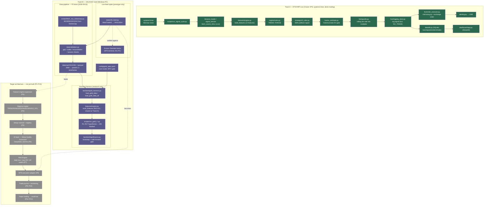

# System Architecture

Generated 2026-09-03. This is a snapshot diagram, not a source of truth — trust
`docs/HANDOFF.md` (crypto live track), `docs/XAU_LIVE_HANDOFF.md` (XAU machine/account
prep), and `docs/XAU_ARCHITECTURE_AUDIT.md` (XAU target architecture + phase status) over
this file if they disagree. Regenerate this diagram rather than hand-editing it as the
system evolves.

## Legend

- **Green (Track A)** — ETH/XRP: live on the Oracle VPS right now (demo trading, no real money).
- **Purple (Track B)** — XAU/USD: data pipeline + validation complete as of P2 (2026-09-03);
  backtest harness is research-only (all 8 tested hypotheses R1–R17 falsified, see
  `docs/research/GOLD_HANDOFF.md`); the MT5 live-feed module is a feasibility spike, not a
  production loop.
- **Gray, dashed (Future)** — P3–P13 of the XAU target architecture per
  `docs/XAU_ARCHITECTURE_AUDIT.md` §10 — none of this exists in code yet.
